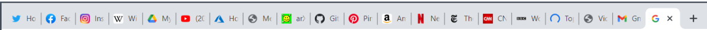
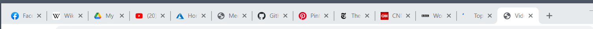
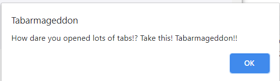
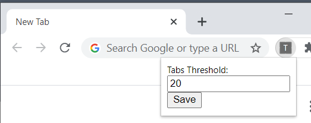

# Tabarmageddon
Tabarmageddon is a Chrome extension.  
If the number of tabs exceeds the limit, tabs will get armageddon.  
You will lose some tabs randomly.  
**In the BEST case, half of tabs will be deleted.**  
Following before/after images show an example.

Before

After

Then, you can reflect about opening too many tabs and get motivated  
to have the habit of storing those pages in some bookmark services or private spaces.

The default threshold is 20.  
You can change this setting by extension menu.  

## Installation
Tabarmageddon is not available on the Chrome store.  
You can install this manually, if you like such a joke extension.

* [Download](https://github.com/masskaneko/tabarmageddon/archive/main.zip) or git clone Tabarmageddon
* Open chrome://extensions
* Enable Developer mode
* Click the LOAD UNPACKED button and select the downloaded Tabarmageddon directory

## License
[MIT](LICENSE)